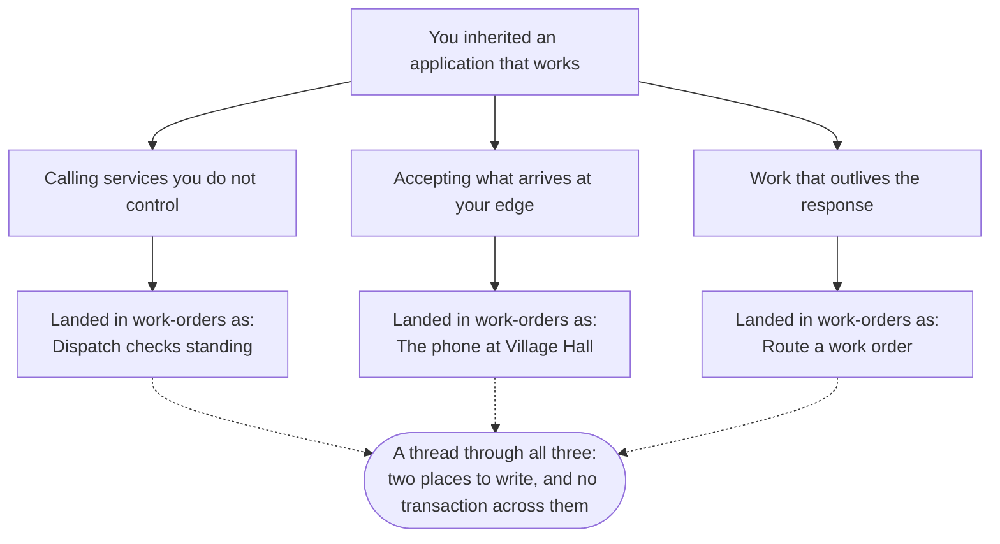

# web-api-200: everything we did, and everything we did not get to

This is the whole set of labs, grouped by what they are about rather than by the order
we ran them in, with the polads so each one starts from a working solution.

**The ones marked optional are the ones we probably did not run.** They are not extra
credit and they are not harder for the sake of it - each one is a question the lab
above it ends on. If you only do one thing with this folder, do those.

Nothing here needs an instructor. Every lab says what it is building, and every reveal
says what should happen, so you can check yourself.

## Read the numbers before you start

**The numbers are not a running order.** They group labs; they do not sequence them.

- Each block of ten is **one theme**. Everything in the twenties is about the same job.
- The labs ending in `1`, `2`, `3` are **how you learn it**. Do these first, in order.
- The one ending in **`0` is where it lands in the village's own codebase, and it comes
  after the ones that taught it.** It sorts first because it is what all the others are
  *for* - read it early if you want to know where you are heading, but do it at the end.
- A decimal - `21.1` - is **optional, and hangs off the lab before the dot**. Do it
  straight after that one, or skip it. It is never a prerequisite for anything else.

So the second block is read like this:

```
21  ->  21.1  ->  22  ->  22.1  ->  20
        optional        optional        lands in work-orders
```

**The tables below are in that order, not in number order.**

## The three paths



**The dotted line is the one worth carrying.** It is not a topic we covered; it is a
shape that turned up in all three paths. A failure and an empty answer sharing a
variable. A fault and an outcome sharing an exception type. A work order written to a
database and an announcement that never went out. Every one of them is two things that
had to agree, and nothing making them agree.

## Calling services you do not control

Another service has something you need. It is not yours, you cannot restart it, and everything it publishes about itself is a document rather than a promise.

**This landed in the work-order application as:** Before work goes to anyone outside the village, somebody has to check that we are allowed to use them.

Run order: `11`  ->  `11.1`  ->  `12`  ->  `12.1`  ->  `10`  ->  `10.1`

| | Lab | |
|---|---|---|
| `11` | [Calling another service](01-calling-services/11-calling-another-service/lab.md) | core |
| `11.1` | [Failing faster than the default](01-calling-services/11.1-failing-faster-than-the-default/lab.md) | optional |
| `12` | [When a field is missing](01-calling-services/12-when-a-field-is-missing/lab.md) | core |
| `12.1` | [When the whole response is wrong](01-calling-services/12.1-when-the-whole-response-is-wrong/lab.md) | optional |
| `10` | [Dispatch checks standing](01-calling-services/10-dispatch-checks-standing/lab.md) | **lands in work-orders** |
| `10.1` | [A client you did not write](01-calling-services/10.1-a-client-you-did-not-write/lab.md) | optional |

## Accepting what arrives at your edge

Requests arrive from outside. Something has to decide what is acceptable, and something has to tell the caller when it is not, in a shape they can rely on.

**This landed in the work-order application as:** Somebody calls Village Hall about a pothole. Whoever picks up needs to put it in the same place everything else goes.

Run order: `21`  ->  `21.1`  ->  `22`  ->  `22.1`  ->  `20`

| | Lab | |
|---|---|---|
| `21` | [Where parameters come from](02-the-edge/21-where-parameters-come-from/lab.md) | core |
| `21.1` | [Catching a bad parameter yourself](02-the-edge/21.1-catching-a-bad-parameter-yourself/lab.md) | optional |
| `22` | [Validating what arrives](02-the-edge/22-validating-what-arrives/lab.md) | core |
| `22.1` | [Making the errors agree](02-the-edge/22.1-making-the-errors-agree/lab.md) | optional |
| `20` | [The phone at Village Hall](02-the-edge/20-the-phone-at-village-hall/lab.md) | **lands in work-orders** |

## Work that outlives the response

You answered before the work was finished. That is faster and more robust, and it changes what your response means.

**This landed in the work-order application as:** When a report comes in, the resident should hear that we got it, and the right department should get the work. The person filling in the form should not wait for either.

Run order: `31`  ->  `31.1`  ->  `31.2`  ->  `31.3`  ->  `32`  ->  `30`

| | Lab | |
|---|---|---|
| `31` | [Publishing a message](03-after-the-response/31-publishing-a-message/lab.md) | core |
| `31.1` | [Messages that wait](03-after-the-response/31.1-messages-that-wait/lab.md) | optional |
| `31.2` | [Two of the same service](03-after-the-response/31.2-two-of-the-same-service/lab.md) | optional |
| `31.3` | [The message nobody can handle](03-after-the-response/31.3-the-message-that-keeps-coming-back/lab.md) | optional |
| `32` | [Work that runs later](03-after-the-response/32-work-that-runs-later/lab.md) | optional |
| `30` | [Route a work order](03-after-the-response/30-route-a-work-order/lab.md) | **lands in work-orders** |

## Where it started

- [How This Course Works](00-opening/00-how-this-course-works/lab.md)

## Running one of these later

Each lab folder has a `lab.md` and, where it needs one, a `polad/` - a working solution
to start from, so you are never typing `dotnet new` to get to the interesting part.

```bash
cd <lab folder>/polad
dotnet run --project Practice.AppHost
```

The labs that work in the village's own application say so at the top and do not have a
polad. Those need the work-order solution you already have.

You will need Docker Desktop running for anything with a database or a broker in it.

---

*18 labs, 9 of them optional. Generated from the labs directory - if
this list and the folders disagree, the folders are right.*
